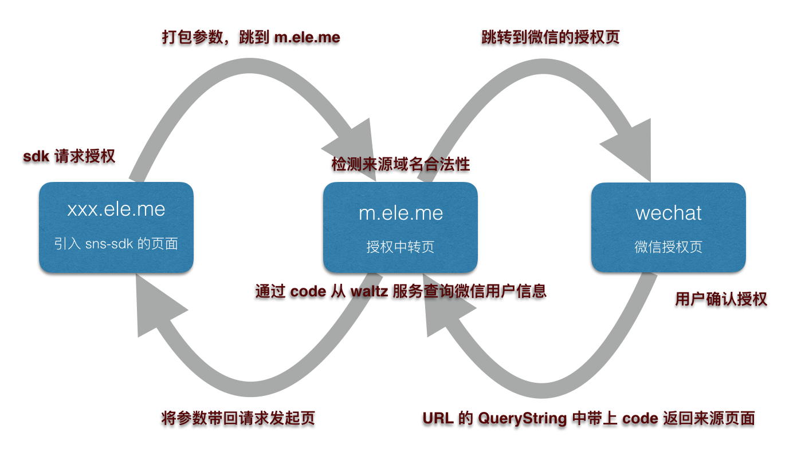

## sns-sdk

获取第三方授权信息，以及分享的配置

1. 支持微信、QQ 以及微博的授权，并返回用户信息
2. 支持微信分享配置

## 依赖

1. 只有在 `*.ele.me` 下才可以使用
2. 平台的 sdk eg: weixin.js

## 引入方式

```html
<!-- 判断微信浏览器，并引入微信的 SDK -->
<script>
if (/MicroMessenger/i.test(navigator.userAgent))
  document.write('<script src="//shadow.elemecdn.com/npm/weixin-js-sdk@1.2.0/index.original.js"><\/script>')
</script>
<!-- 引入 sns-sdk，注意版本 -->
<script src="//shadow.elemecdn.com/gh/eleme/sns-sdk@{x.y.z}/sns-sdk.min.js"></script>
```

## 使用

调用微信分享功能 [更多配置可以看这里](https://mp.weixin.qq.com/wiki?t=resource/res_main&id=mp1421141115) 的「分享接口」

```js
sns.share({
  title: '分享标题',
  desc: '分享描述',
  type: '分享类型',
  // 注意！imgUrl 和 link 必须是以 http 或 https 开头的绝对 URL
  imgUrl: '分享图标',
  link: '分享链接'
})
```

获取用户信息（可能会跳到授权页再链接回来，**导致页面重新加载**）
[user 数据结构](http://mp.weixin.qq.com/wiki/17/c0f37d5704f0b64713d5d2c37b468d75.html)

```js
sns.getUserInfo(user => {
  /**
   # 此处 user 的值为
   {
     openid: "唯一标识符",
     name: "用户昵称",
     avatar: "头像链接",
     // ...
   }
  **/
})
```

## 微信授权逻辑


